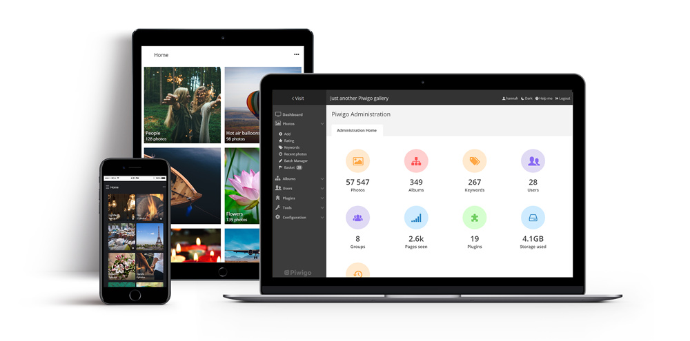

# Piwigo pour YunoHost

[](https://dash.yunohost.org/appci/app/piwigo)    
[](https://install-app.yunohost.org/?app=piwigo)

*[Read this readme in english.](./README.md)*
*[Lire ce readme en français.](./README_fr.md)*

> *Ce package vous permet d'installer Piwigo rapidement et simplement sur un serveur YunoHost.
Si vous n'avez pas YunoHost, regardez [ici](https://yunohost.org/#/install) pour savoir comment l'installer et en profiter.*

## Vue d'ensemble

[Piwigo](http://piwigo.org) is a photo gallery software for the web, built by an active community of users and developers. Extensions make Piwigo easily customizable.


**Version incluse :** 11.5.0~ynh1


## Captures d'écran



## Avertissements / informations importantes

## YunoHost specific features

In addition to Piwigo core features, the following are made available with this package:
 * Integrate with YunoHost users and SSO:
   * private mode: limit access to YunoHost users
   * public mode:
     * SSO for YunoHost users
     * allow other users management, and guest mode
 * Allow one YunoHost user to be the administrator (set at the installation)

## Documentations et ressources

* Documentation YunoHost pour cette app : https://yunohost.org/app_piwigo
* Signaler un bug : https://github.com/YunoHost-Apps/piwigo_ynh/issues

## Informations pour les développeurs

Merci de faire vos pull request sur la [branche testing](https://github.com/YunoHost-Apps/piwigo_ynh/tree/testing).

Pour essayer la branche testing, procédez comme suit.
```
sudo yunohost app install https://github.com/YunoHost-Apps/piwigo_ynh/tree/testing --debug
ou
sudo yunohost app upgrade piwigo -u https://github.com/YunoHost-Apps/piwigo_ynh/tree/testing --debug
```

**Plus d'infos sur le packaging d'applications :** https://yunohost.org/packaging_apps